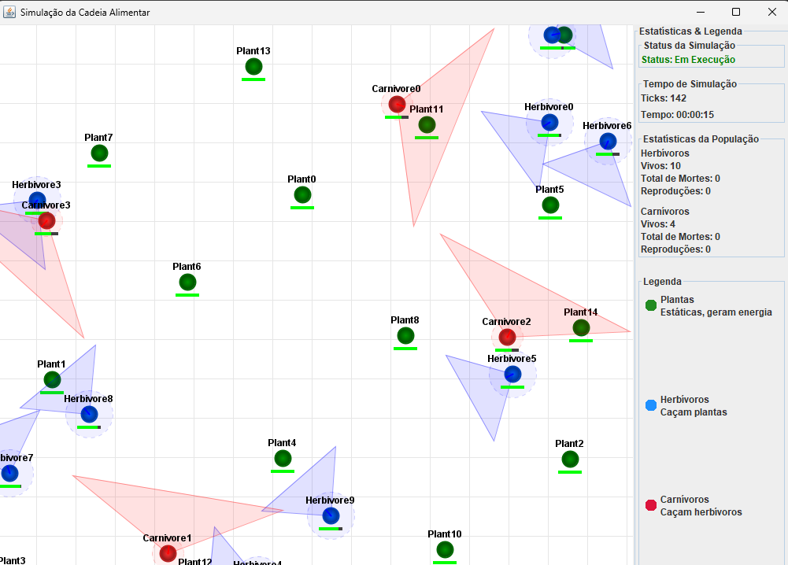

# 2023.2_G1_SMA_FoodChain

**Disciplina**: FGA0210 - PARADIGMAS DE PROGRAMAÇÃO - T01

**Número do Grupo**: 01

**Paradigma**: SMA (Sistema Multi-Agentes)

## Alunos

| Matrícula  | Aluno                          |
| ---------- | ------------------------------ |
| 20/0056981 | Arthur Ferreira Rodrigues      |
| 19/0084600 | Arthur José Nascimento de Lima |
| 19/0084731 | Augusto Duraes Camargo         |

## Sobre o Projeto

Este projeto implementa uma simulação de cadeia alimentar utilizando o framework JADE (Java Agent DEvelopment Framework). A simulação modela um ecossistema com três tipos de agentes:

- **Plantas**: Geram energia através de fotossíntese
- **Herbívoros**: Se alimentam de plantas
- **Carnívoros**: Caçam herbívoros

Cada agente possui comportamentos autônomos e interage com outros agentes através de mensagens, seguindo o paradigma de programação orientada a agentes. A simulação inclui conceitos como:

- Campo de visão dos agentes
- Sistema de energia
- Comportamentos de caça e fuga
- Reprodução dos agentes
- Morte por falta de energia

## Screenshots



## Instalação

**Linguagens**: Java

**Tecnologias**: JADE Framework, Maven

### Pré-requisitos

- Java JDK 17 ou superior
- Maven 3.6 ou superior

### Passos para Instalação

1. Clone o repositório:

    ```bash
    git clone https://github.com/UnBParadigmas2024-2/2024.2-G1-SMA-FoodChain.git
    ```

2. Entre no diretório do projeto:

    ```bash
    cd 2024.2-G1-SMA-FoodChain
    ```

3. Compile o projeto com Maven:

    ```bash
    mvn clean install
    ```

## Uso

1. Execute a simulação:

    ```bash
    mvn clean compile exec:java
    ```

2. A interface gráfica será iniciada mostrando:

   - Plantas (círculos verdes)
   - Herbívoros (círculos azuis)
   - Carnívoros (círculos vermelhos)

3. Observe as interações:

   - Plantas gerando energia
   - Herbívoros caçando plantas
   - Carnívoros caçando herbívoros
   - Campo de visão dos agentes (áreas sombreadas)
   - Barras de energia abaixo de cada agente

4. A simulação termina automaticamente quando:

   - Todos os herbívoros morrem, ou
   - Todos os carnívoros morrem

## Vídeo

[Link para o vídeo](https://youtu.be/QmD0YewB3dY)

## Participações

| Nome do Membro  | Contribuição                                                                                                                                                                                                                                                                                                                                           | Significância da Contribuição | Comprobatórios                                                                                                                                                                                                                                                                                                                                                                                                                                                                                                                                                                                                                                                                                                                                                                                                                                                                                                                                                                                                                                                                                                                                                                                                                                                                                                                                                                                                                                                                                                                                                                                                                                                                                                                                                                                                                                                                                                               |
| --------------- | ------------------------------------------------------------------------------------------------------------------------------------------------------------------------------------------------------------------------------------------------------------------------------------------------------------------------------------------------------ | ----------------------------- | ---------------------------------------------------------------------------------------------------------------------------------------------------------------------------------------------------------------------------------------------------------------------------------------------------------------------------------------------------------------------------------------------------------------------------------------------------------------------------------------------------------------------------------------------------------------------------------------------------------------------------------------------------------------------------------------------------------------------------------------------------------------------------------------------------------------------------------------------------------------------------------------------------------------------------------------------------------------------------------------------------------------------------------------------------------------------------------------------------------------------------------------------------------------------------------------------------------------------------------------------------------------------------------------------------------------------------------------------------------------------------------------------------------------------------------------------------------------------------------------------------------------------------------------------------------------------------------------------------------------------------------------------------------------------------------------------------------------------------------------------------------------------------------------------------------------------------------------------------------------------------------------------------------------------------- |
| Arthur Ferreira | - Setup inicial do projeto<br>- Criação do sistema de posicionamento dos agentes<br>- Implementação dos métodos de criação e atualização dos agentes<br>- Desenvolvimento do agente herbívoro e seus comportamentos<br>- Implementação do campo de visão dos agentes<br>- Criação do agente carnívoro e seus comportamentos<br>- Sistema de reprodução | Excelente                     | [Setup Inicial](https://github.com/UnBParadigmas2024-2/2024.2-G1-SMA-FoodChain/commit/951286504966553234301a4275cc75d3f092dca2);[Criacao da Posicao dos Agentes](https://github.com/UnBParadigmas2024-2/2024.2-G1-SMA-FoodChain/commit/c06fd162db492de3e78d70a653701642b2d3584e); [Metodo de Criacao e atualizacao dos Agentes](https://github.com/UnBParadigmas2024-2/2024.2-G1-SMA-FoodChain/commit/4b9736eb71b950bbe0aaf3af31aea25d95a113ab); [Criação do agente herbivoro e berhavior dele](https://github.com/UnBParadigmas2024-2/2024.2-G1-SMA-FoodChain/commit/05cfd154d2997f1464080dc5f9849bde9970847e); [Melhora na movimentacao do herbivoro](https://github.com/UnBParadigmas2024-2/2024.2-G1-SMA-FoodChain/commit/a2cfc1309f36754b1b8cd626669393688796970a);[Campo de visao dos herbivoros](https://github.com/UnBParadigmas2024-2/2024.2-G1-SMA-FoodChain/commit/dfae2f70b66c174961c87377d5f6c8a4d4859291); [Melhoras na movimentacao do herbivoro](https://github.com/UnBParadigmas2024-2/2024.2-G1-SMA-FoodChain/commit/1dfec3f58cf075add142b9821414abb7ac22acd7); [Ajuste Bug FOV](https://github.com/UnBParadigmas2024-2/2024.2-G1-SMA-FoodChain/commit/b160fd307e732dbcf50dfef19a36d568e8c35558); [Agente Carnivoro com behaviour](https://github.com/UnBParadigmas2024-2/2024.2-G1-SMA-FoodChain/commit/b0eefd1be44f0326cc834be555e4bd2fc64a589f); [FOV do herbivoro](https://github.com/UnBParadigmas2024-2/2024.2-G1-SMA-FoodChain/commit/7abb8e7f0acf597e7d554ef2df67e7c56c8835cb); [Criacao do Carnivoro](https://github.com/UnBParadigmas2024-2/2024.2-G1-SMA-FoodChain/commit/b0eefd1be44f0326cc834be555e4bd2fc64a589f); [FOV do Carnivoro](https://github.com/UnBParadigmas2024-2/2024.2-G1-SMA-FoodChain/commit/7abb8e7f0acf597e7d554ef2df67e7c56c8835cb) ; [Adiciona Reprodução](https://github.com/UnBParadigmas2024-2/2024.2-G1-SMA-FoodChain/commit/a2c5931d202341ad3ce3743ca231e858b03e2563) |
| Arthur José     | - Desenvolvimento da interface gráfica de simulação<br>- Implementação do sistema de energia e fome<br>- Criação do painel de controle<br>- Melhorias na visualização dos agentes<br>- Balanceamento do ecossistema<br>- Sistema de congelamento da simulação                                                                                          | Excelente                     | [Auxilio na Criação/Atualização de Agentes](https://github.com/UnBParadigmas2024-2/2024.2-G1-SMA-FoodChain/commit/4b9736eb71b950bbe0aaf3af31aea25d95a113ab); [Auxilio Na Criação do Planta](https://github.com/UnBParadigmas2024-2/2024.2-G1-SMA-FoodChain/commit/e33675f36c8121d4b9ddfc56ae8e171bcfa7a0e1); [Criação da Interface de Simulação](https://github.com/UnBParadigmas2024-2/2024.2-G1-SMA-FoodChain/commit/4bbeaae0bf35c55b529c8a42caa607954e2b01b7); [Tornando a Simulação mais realista com a fome dos animais](https://github.com/UnBParadigmas2024-2/2024.2-G1-SMA-FoodChain/commit/841ebf8f01a973c7ae842ac315278e7abe882e4b); [Auxilio na movimentacao do herbivoro](https://github.com/UnBParadigmas2024-2/2024.2-G1-SMA-FoodChain/commit/a2cfc1309f36754b1b8cd626669393688796970a); [Criação do Painel de Controle](https://github.com/UnBParadigmas2024-2/2024.2-G1-SMA-FoodChain/commit/ee32201c74e475abca500a31e7e53dba5e988b77); [Melhoras na Visualização dos agentes](https://github.com/UnBParadigmas2024-2/2024.2-G1-SMA-FoodChain/commit/751b507b14ca7c0db1948f4308c48ba69adc780e); [Melhoras na movimentacao do herbivoro](https://github.com/UnBParadigmas2024-2/2024.2-G1-SMA-FoodChain/commit/1dfec3f58cf075add142b9821414abb7ac22acd7); [Adicionando Planta e balanceando](https://github.com/UnBParadigmas2024-2/2024.2-G1-SMA-FoodChain/commit/1bdda5dabb5efbe6b49628a9599e24fde2fa508d); [Auxiliando movimento de Caça](https://github.com/UnBParadigmas2024-2/2024.2-G1-SMA-FoodChain/commit/32f011fa77bdad39641a0263f2f04dc070a1ced4); [Adicionando Herbivoro e balanceando](https://github.com/UnBParadigmas2024-2/2024.2-G1-SMA-FoodChain/commit/f62b1b1551433b6eac2e063f7bf7324ac8c1a4de) ; [Congelando a simulacao](https://github.com/UnBParadigmas2024-2/2024.2-G1-SMA-FoodChain/commit/0f304d3b923c29c98316efcb053a5a8eabcafd00)                                                |
| Augusto Duraes  | - Implementação da movimentação dos herbívoros<br>- Desenvolvimento da lógica de alimentação<br>- Sistema de comunicação entre agentes<br>- Lógica de caça dos carnívoros<br>- Implementação do sistema de logs<br>- Melhorias na movimentação dos agentes                                                                                             | Excelente                     | [Movimentação do herbívoro](https://github.com/UnBParadigmas2024-2/2024.2-G1-SMA-FoodChain/commit/bfdfe83fb1940cc246cb03d339207840d0e7e066); [Corrigindo problema na Movimentação do herbívoro](https://github.com/UnBParadigmas2024-2/2024.2-G1-SMA-FoodChain/commit/bc1297425a6ea82785a0d6c1dc3e1b90c66d201d); [Criação de toda lógica de alimentação com passagem de mensagem entre agentes](https://github.com/UnBParadigmas2024-2/2024.2-G1-SMA-FoodChain/commit/863fd26a2844159f3445bc10e77ad2a953525df5);[Lógica da alimentacao dos carnivoros](https://github.com/UnBParadigmas2024-2/2024.2-G1-SMA-FoodChain/commit/32f011fa77bdad39641a0263f2f04dc070a1ced4); [Melhoras na movimentacao e nos limites do Agente Carnivoro](https://github.com/UnBParadigmas2024-2/2024.2-G1-SMA-FoodChain/commit/ee8be5700a08415d935f7563ea7df6591035f1bc) ; [Melhorando caça e perseguição do carnivoro](https://github.com/UnBParadigmas2024-2/2024.2-G1-SMA-FoodChain/commit/9ad96939dc354deb085c82b31f93c89f582a6c84) ; [Geracao de logs](https://github.com/UnBParadigmas2024-2/2024.2-G1-SMA-FoodChain/commit/abb3ef26c4c31ff596b4b0ec1b16bfbec23b7a83)                                                                                                                                                                                                                                                                                                                                                                                                                                                                                                                                                                                                                                                                                                                                                                      |

### Lições Aprendidas

Arthur Ferreira:

- Implementação de comportamentos autônomos e sistemas de reprodução
- Desenvolvimento de mecanismos de percepção e campo de visão
- Criação de agentes com diferentes papéis no ecossistema

Arthur José:

- Desenvolvimento de interfaces gráficas para sistemas multiagentes
- Implementação de controles e visualização de estados dos agentes
- Balanceamento de parâmetros para equilíbrio do sistema

Augusto Durães:

- Programação de comunicação entre agentes usando JADE
- Desenvolvimento de comportamentos de caça e perseguição
- Implementação de sistemas de logging e depuração

### Percepções

- O paradigma de SMA oferece uma abordagem natural para modelar interações complexas entre entidades autônomas
- A comunicação entre agentes através de mensagens permite um desacoplamento efetivo entre os componentes
- O framework JADE simplifica significativamente o desenvolvimento de sistemas multiagentes
- A visualização gráfica em tempo real ajuda a compreender melhor o comportamento dos agentes
- O balanceamento entre os diferentes tipos de agentes é crucial para manter o ecossistema estável

## Outros

### Principais Desafios

1. **Comunicação entre agentes**: Implementar a comunicação entre os agentes de forma que eles possam se comunicar e interagir entre si utilizando ACLMessage. Consideramos que esse foi um dos pontos mais desafiadores do projeto, pois a comunicação entre agentes requer entendimento de como utilizar o ACLMessage. O paradigma SMA exige uma compreensão profunda dos mecanismos de comunicação entre agentes, que é fundamental para o funcionamento do sistema.
2. **Comportamento de Caça**: Implementar o comportamento de busca por energia dos agentes herbivoros e carnivoros
3. **Implementação do Campo de Visão e Movimentação**: Implementar o campo de visão e a movimentação dos agentes de forma que eles possam se mover pelo ambiente e interagir apenas com os agentes que estão dentro do campo de visão.
4. **Balanceamento do Ecossistema**: Ajustar parâmetros como taxas de energia, reprodução e consumo visando uma simulação mais realista de equilíbrio ecológico
5. **Reprodução**: Implementar a reprodução dos agentes de forma que eles sejam capazes de se reproduzir e gerar novos agentes contribuindo com a sobrevivencia da espécie sem desbalancear o ecossistema
6. **Coordenação de Agentes**: Gerenciar múltiplos agentes autônomos e suas interações com threads. A natureza distribuída do paradigma SMA torna este aspecto particularmente desafiador, pois cada agente opera de forma independente mas precisa se coordenar com os demais.
7. **Desempenho**: Otimizar o processamento com muitos agentes simultâneos
8. **Visualização**: Implementar uma interface gráfica que represente os agentes e suas interações de forma clara e intuitiva

### Pontos Positivos

1. **Paradigma**: O uso do paradigma de Sistemas Multi-Agentes permitiu modelar de forma natural as interações complexas entre os diferentes tipos de agentes (plantas, herbívoros e carnívoros)
2. **Comunicação**: A troca de mensagens entre agentes através do JADE facilitou a implementação de comportamentos complexos como caça e alimentação
3. **Autonomia**: Cada agente possui comportamentos independentes e toma decisões baseadas em seu estado interno e percepção do ambiente
4. **Behaviours**: O uso de TickerBehaviour e CyclicBehaviour do JADE permitiu implementar tanto comportamentos periódicos (como geração de energia das plantas e movimentação dos agentes) quanto comportamentos contínuos (como resposta a mensagens)
5. **Emergência**: O sistema como um todo apresenta comportamentos emergentes interessantes, como formação de padrões de caça e equilíbrio populacional
6. **Diferencial**: Interação entre agentes orientada a campos de visão e ações de caça e fuga, além de um sistema de energia e fome que permite a simulação de um ecossistema mais realista
7. **Visualização Intuitiva**: Interface gráfica que permite acompanhar facilmente o estado da simulação
8. **Logging Detalhado**: Sistema de logs que facilita o debugging e análise do comportamento dos agentes

### Experiência com o Paradigma

O desenvolvimento deste projeto proporcionou uma compreensão prática dos conceitos de:

- Autonomia de agentes
- Comunicação assíncrona
- Comportamentos reativos e proativos
- Coordenação descentralizada
- Emergência de comportamentos complexos a partir de regras simples

## Fontes

- [Documentação oficial JADE](https://jade.tilab.com/)
- [Tutorial JADE](https://jade.tilab.com/doc/tutorials/JADEProgramming-Tutorial-for-beginners.pdf)
